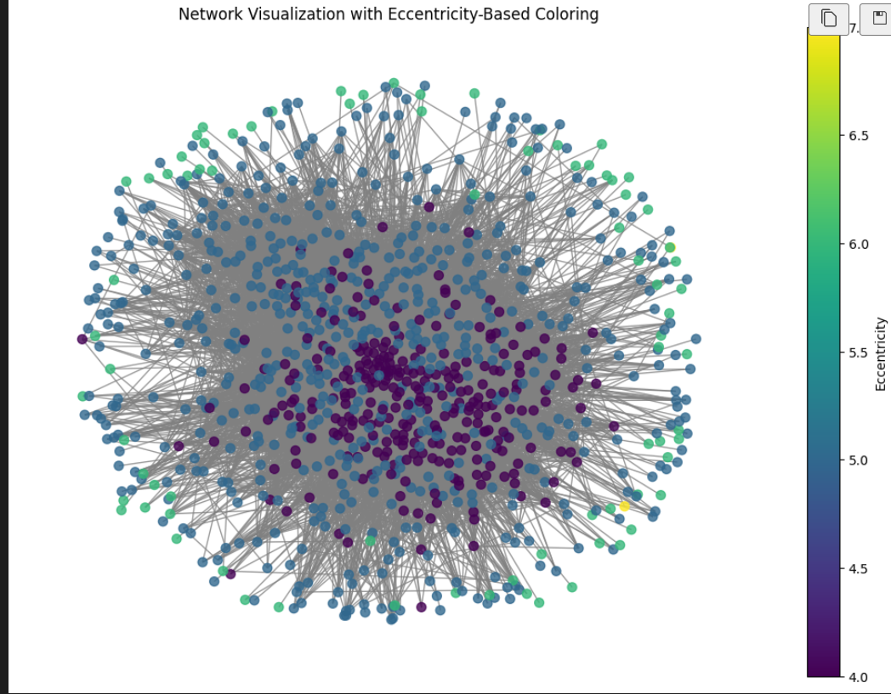
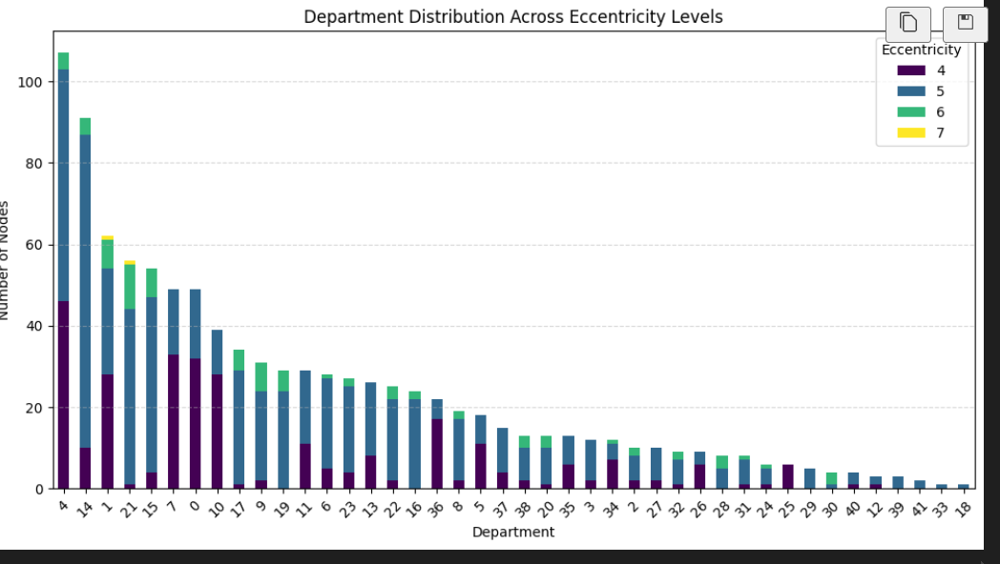
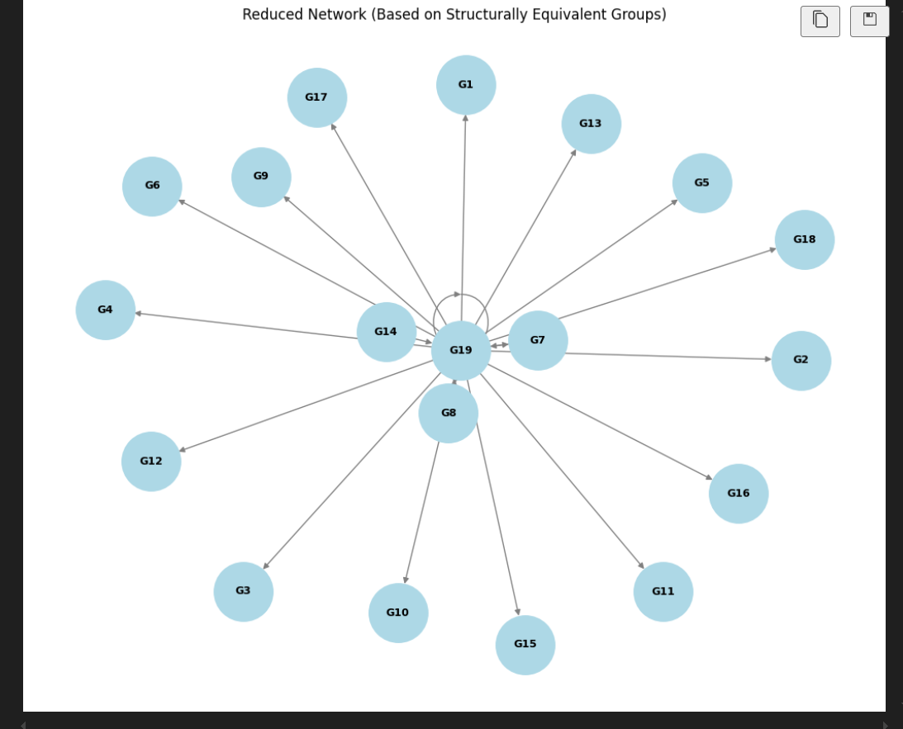

# 📧 Social Network Analysis of Institutional Email Communication

This project analyzes internal email communications at a European research institution using **Social Network Analysis (SNA)**. By modeling emails as a directed graph between anonymized individuals, we explore communication patterns, influential nodes, departmental roles, and network robustness.

---
## 📁 Repository Contents

- `sna.ipynb` — Main analysis notebook  
- `sna_report.docx` — Full report with figures and interpretation  
- `degree_metrics.csv` — Centrality and degree metrics per node  
- `emailDepartments.csv` — Node-to-department mappings  
- `email_Eu_core_edges.csv` — Raw email edges (source → target)  
- `email_Eu_core_department_labels.csv` — Department ID to department name  
- `filtered_edges_corrected2.csv` — Cleaned email edge list (no self-loops)  
- `filtered_nodes_corrected2.csv` — Filtered node list with department info  
- `network-graph.png` — Screenshot  
- `dept_distribution.png` — Screenshot  
- `reduced_network.png` — Screenshot  
- `comm-between-departments.png` — Screenshot  
- `dept-distribution.png` — Screenshot  

---

## 🔍 Project Objectives

- Identify influential individuals and departments
- Detect hierarchical patterns and structural equivalence
- Examine interdepartmental collaboration and communication flow
- Test robustness of the communication network
- Recommend improvements for communication efficiency

---

## 📊 Dataset Overview

- **Source**: [SNAP: Email-Eu-core](http://snap.stanford.edu/data/email-Eu-core.html)
- **Nodes**: 1,005 researchers (anonymized)
- **Edges**: 25,571 directed email records (internal only)
- **Features**:
  - Directional edges from sender to receiver
  - Department-level affiliation for each node
  - No external communication included
  - Self-loops removed for clarity

---

## ⚙️ Technologies Used

- **Python 3.x**
- **Libraries**:
  - `NetworkX` – graph modeling, centrality, community detection
  - `Pandas`, `NumPy` – data wrangling
  - `Matplotlib`, `Seaborn` – visualizations
  - `CSV`, `Collections`, `OS`, `Random` – data handling & simulation

---

## 📈 Analysis Summary

This project covers a complete social network analysis of institutional email communication. Major steps include:

- Network structure analysis
- Department-level communication patterns
- Degree and centrality distributions
- Eccentricity and path-based communication efficiency
- Reciprocity, transitivity, and group cohesion
- Community detection using Girvan-Newman algorithm
- Robustness analysis via node removal simulations
- Identification of hierarchical roles and structurally equivalent actors

---

## 🖼️ Visualizations

Here are a few important visualizations from the analysis:

-   
-   
-   
-   
-   

> 📌 For complete analysis, refer to the Jupyter notebook [`sna.ipynb`](./sna.ipynb)  
> 📄 For detailed methodology, results, and interpretation, see [`sna_report.docx`](./sna_report.docx)

---

## ✅ How to Run

1. Clone or download this repo  
2. Place all `.csv` files in the root directory  
3. Open and run `sna.ipynb` in Jupyter Notebook  
4. Add screenshots to the `screenshots/` folder if you export visuals

---

## 📌 Recommendations

- Use Slack/MS Teams for better coordination
- Balance communication load by decentralizing key hubs
- Foster collaboration between siloed departments
- Avoid excessive reliance on central nodes

---

## 👨‍💻 Contributors

- **Alireza Hatami** – ah3733@drexel.edu  
- **Robert Lignowski** – rml345@drexel.edu  
- **Ram Kishore KV** – rk999@drexel.edu  

---

## 📚 References

- Leskovec & Krevl (2014) – [SNAP Dataset](http://snap.stanford.edu/data/email-Eu-core.html)  
- Michalski et al. (2011), Uddin & Jacobson (2013)  
- Girvan & Newman (2002) – Community Detection  
- Kazienko et al. (2009), Christidis & Losada (2019)  

---
